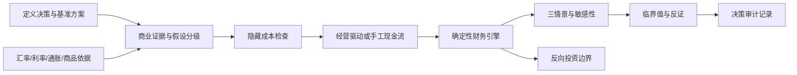

# 完整运行逻辑

## 输入到结论

1. 用户建立项目、不做项目的基准和替代方案。
2. 每项假设记录为已知、估算或待验证，并附来源、日期和可信度。
3. 隐藏成本被逐项确认；沉没成本只展示。
4. 经营驱动生成逐期收入，再扣除运营成本、税费、资本开支和营运资金。
5. 财务引擎计算 NPV、IRR、MIRR、ROI、利润指数和回收期。
6. 风险引擎计算三情景、单因素敏感性和 NPV=0 的临界值。
7. 规则引擎按确定性结果生成建议；解释层不能篡改计算。
8. 反向估值把最低可行投入、交易区间和价值上限分开显示。
9. 保存时将项目 JSON 写入本地 SQLite；报告可导出 Markdown、JSON 和 CSV。

## 建议规则

- 基准和乐观均为负：拒绝。
- 基准为负但乐观为正：暂缓。
- 基准为正但关键假设待验证：继续验证。
- 基准为正但悲观为负或有遗漏成本：满足条件后推进。
- 证据充分且悲观仍为正：建议推进。
