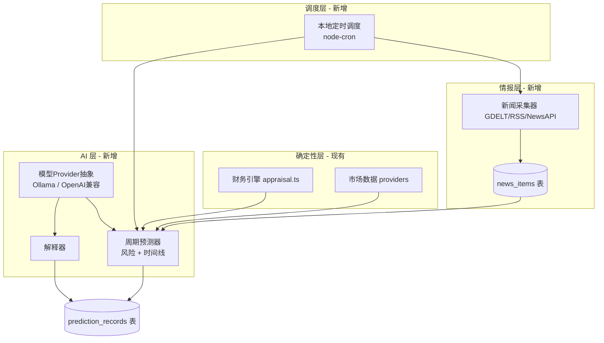

# 衡策 AI 增强方案：模型接入、周期预测与新闻情报

> 版本：0.1（设计稿） 日期：2026-08-27
> 状态：待评审。本文档只定义方案，不改变现有确定性引擎的任何行为。

---

## 0. 不可逾越的三条边界

本方案在《完整项目文档》既有原则下设计，AI 引入后这三条反而更重要：

1. **AI 不能碰数学。** NPV、IRR、反向估值、情景、临界值全部由确定性引擎计算。AI 只做三件事：**解释**结构化结果、**生成**待验证假设与风险叙述、**整理**外部情报。AI 输出的任何数字都必须来自引擎输出或带来源的新闻快照，AI 不得"发明"现金流。
2. **一切可审计。** 每次 AI 预测记录：使用的模型、输入快照哈希、原始提示词模板版本、输出原文、生成时间。每条新闻保留 URL、来源、发布时间、抓取时间。
3. **本地优先，密钥可选。** 默认对接本地模型（Ollama），不强制任何云端 Key；云端模型是用户可选项，Key 只存本地 `.env.local`，永不进 Git。

## 1. 总体架构



**分层职责一句话版**：情报层负责"世界发生了什么"，确定性层负责"数字说明什么"，AI 层负责"这两件事合起来意味着什么"，调度层负责"多久想一次"。

## 2. AI 模型接入（Provider 抽象）

### 2.1 接口设计

```ts
// lib/ai/provider.ts
export interface AIMessage { role: "system" | "user"; content: string }
export interface AIProvider {
  name: string;                                    // "ollama:qwen3:8b"
  complete(messages: AIMessage[], options?: { temperature?: number; json?: boolean }): Promise<string>;
  available(): Promise<boolean>;                   // 健康检查，不可用则整个 AI 功能降级为规则模式
}
```

### 2.2 两个实现

| Provider | 场景 | 配置 |
| --- | --- | --- |
| `OllamaProvider` | **默认**。本地模型，零成本、离线、数据不出门 | `OLLAMA_BASE_URL`（默认 `http://localhost:11434`）、`OLLAMA_MODEL`（建议 `qwen3:8b` 或 `llama3.1:8b`） |
| `OpenAICompatProvider` | 可选。任何 OpenAI 兼容端点（DeepSeek、通义、Kimi、OpenAI 均可） | `AI_BASE_URL`、`AI_API_KEY`、`AI_MODEL`，存 `.env.local` |

### 2.3 降级策略（关键）

`available()` 返回 false 时，AI 层**不是报错而是降级**：

- 周期预测 → 退化为纯规则预测（只用临界值、敏感性排序、隐藏成本缺口生成风险清单）；
- 新闻摘要 → 只存标题原文，不生成摘要；
- UI 明确标注"当前为规则模式，未使用 AI 模型"。

这保证没有 GPU、没有网络、没有 Key 的用户，核心功能一寸不少。

### 2.4 输出契约

所有 AI 调用强制 `json: true` 模式，输出必须是结构化 JSON 并通过 `zod` 风格校验（复用 `validate.ts` 的手写校验思路）。校验失败 → 记为失败记录，**不重试超过 1 次**，绝不让半截 JSON 进入报告。

## 3. 新闻情报抓取（按项目定制）

### 3.1 关键词从项目自身生长

不给用户增加"配关键词"的负担。从项目模型自动生成查询词：

```text
项目名 + 行业 + 收益驱动里的客群/品类 + 币种对应经济区
例：「社区咖啡订阅计划」→ ["咖啡 订阅", "咖啡 价格", "餐饮 消费", "中国 零售"]
```

用户可在向导阶段二手动增补/删除关键词（存入 `project.newsKeywords`）。

### 3.2 数据源（按优先级）

| 源 | 成本 | 说明 |
| --- | --- | --- |
| **GDELT** | 免费、无 Key | 全球新闻事件 API，15 分钟级更新，支持中文查询；参考 github.com/topics/gdelt 的多个生产级用法 |
| **RSS 源** | 免费 | 行业媒体 RSS，curl 抓取 + 解析；最简单可靠 |
| NewsAPI / SerpAPI | 付费可选 | 更高质量的检索，用户自配 Key |

**反抓包纪律**：只走官方 API 与公开 RSS；不抓需要登录的页面；遵守 robots.txt；每个源存原始响应摘要以便审计。这是 GitHub 上竞情管道项目的共识做法（合法源优先、保留不可变原始副本）。

### 3.3 存储

```ts
// 新表 news_items
{
  id, projectId, keyword, title, url, source,
  publishedAt, fetchedAt, lang,
  sentiment?: number,        // 可选：本地 FinBERT 类模型或 LLM 打分 [-1, 1]
  summary?: string,          // LLM 生成，标注模型名
  rawExcerpt: string         // 不可变原始摘要
}
```

### 3.4 处理管道

```text
抓取 → 去重(URL 哈希) → 相关性过滤(关键词命中数) → [可选] LLM 摘要与情绪 → 入库
```

参考案例：FinSight-AI（RSS + SQLite + LLM 摘要 + 向量库 Q&A，与我们 SQLite 本地栈几乎同构）；FinBERT_Real-Time-News-Scrapping（实时抓取 + 情绪打分 + CSV 落盘）。

## 4. 周期性"会出现什么问题"预测

### 4.1 预测节奏

调度器（node-cron，应用运行时驻留）按项目设置的周期（默认每周一 07:00）对每个已保存项目跑一次预测。也可在工作台手动点"立即预测"。

### 4.2 预测输入包（确定性组装，AI 只看这个）

```json
{
  "project": "项目模型快照",
  "evaluation": "NPV/IRR/情景/敏感性/临界值（引擎直出）",
  "gaps": "未计入隐藏成本、待验证假设清单",
  "news": "近一周期相关新闻的标题+摘要（最多 10 条，带来源）",
  "previousPrediction": "上一次预测及其实际命中情况"
}
```

### 4.3 预测输出契约

```json
{
  "horizon": "下一周期（如未来 4 周）",
  "risks": [
    { "problem": "可能发生的问题", "likelihood": "高|中|低",
      "impact": "对哪个指标的影响（如 NPV 转负）", "basis": "依据：新闻 URL 或引擎临界值",
      "verificationTask": "下周应做的验证动作" }
  ],
  "timelineRisks": [ "延期风险及理由" ],
  "upside": [ "被低估的机会" ],
  "confidenceNote": "本次预测的证据充分度说明"
}
```

`basis` 字段强制每条预测挂证据——没有证据的预测不允许出现在报告里，这是对抗 AI 幻觉的核心机制。

### 4.4 命中回顾（让系统越用越准）

下周期预测时，把上周期的 `risks` 带回去，由用户（或 LLM 辅助）标记"发生了 / 没发生 / 部分发生"。命中率存入项目档案——这直接呼应文档 10.4 的"乐观偏差校正"：用自身历史预测误差调整风险预备金建议。

参考案例：Dr. Copper 的"持久风险模型 + 每日周期迭代"模式（human-in-the-loop，用户引导日循环生成新情报并修正预测）。

## 5. 项目时间线预测

### 5.1 确定性部分：蒙特卡洛模拟（引擎新增，非 AI）

对关键驱动变量（收入、成本、进度延迟、流失率）设三角/正态分布，跑 N=1000 次模拟，输出：

- NPV 分布（P10 / P50 / P90）——替代单一基准值的"区间式结论"；
- **按期完成的概率**、各档延期（+3 月 / +6 月 / +12 月）的概率；
- 破产线（累计现金流最低点的分布）——回答"最缺钱的时候缺多少"。

参考案例：risk-analytics 话题下的"Treasury-grade liquidity forecasting and Monte Carlo stress testing engine"（情景化现金流风险分析）。

分布参数默认值来自文档 10.4 的乐观偏差研究（成本上浮 20–40%、工期延长 30% 起步），用户可在 UI 里按自身行业调整。

### 5.2 AI 部分：只解释，不生成数字

LLM 拿到蒙特卡洛的分布结果 + 新闻情报后生成：

- "时间线叙述"：为什么 P90 这么差、主要贡献变量是哪个（结合敏感性排序）；
- "新闻佐证"：近期新闻里有哪些支持/反对这个分布假设的证据。

## 6. 风险、收益与投资回报的最终呈现

每次预测完成后，工作台新增"AI 情报与预测"面板，输出四块：

| 区块 | 内容 | 数据来源 |
| --- | --- | --- |
| 风险清单 | 下周期可能发生的问题，按 概率×影响 排序，每条挂证据 | 周期预测器 |
| 收益区间 | NPV P10/P50/P90 + IRR 区间 | 蒙特卡洛（确定性） |
| 投资回报 | 投资价值上限、安全边际、谈判区间（复用反向估值） | 现有引擎 |
| 新闻脉搏 | 近周期新闻时间线 + 情绪走向 + 摘要 | 情报层 |

导出时全部进入决策审计 Markdown/PDF，AI 生成部分统一加盖"AI 辅助生成，非投资、税务或法律建议"水印。

## 7. 数据与 API 扩展

新表：`news_items`、`prediction_records`、`ai_call_logs`（每次调用的提示词版本、模型、耗时、成功/失败）。

新 API：

```text
POST /api/projects/:id/predict      # 立即生成一次周期预测
GET  /api/projects/:id/predictions  # 历史预测列表
POST /api/projects/:id/news/refresh # 立即抓取该项目新闻
GET  /api/projects/:id/news         # 新闻列表
GET  /api/ai/status                 # 当前 Provider 与可用性
POST /api/projects/:id/simulate     # 蒙特卡洛模拟（确定性，无 AI）
```

## 8. 落地路线图

| 阶段 | 内容 | 依赖 |
| --- | --- | --- |
| **M1（约 1 天）** | Provider 抽象 + Ollama 接入 + 降级规则模式 + `/api/ai/status`；蒙特卡洛模拟器 + P10/P50/P90 展示 | 无外部依赖 |
| **M2（约 1 天）** | GDELT 新闻抓取 + 关键词自动生成 + news_items 表 + 工作台新闻面板 | 网络 |
| **M3（约 1 天）** | 周期预测器（输入包组装 + JSON 输出契约 + 命中回顾）+ node-cron 调度 + 预测面板 | M1、M2 |
| **M4（后续）** | 情绪打分、向量检索（ChromaDB 或 sqlite-vec）、预测命中率反哺风险预备金建议、邮件/通知推送 | M3 |

每个阶段都保持"四道验证"纪律：新增纯函数全部有单测，API 全部有路由测试，typecheck/lint/build 全绿才合入。

## 9. 参考案例索引

- GDELT 生态：https://github.com/topics/gdelt （免费全球新闻事件 API）
- FinSight-AI：https://github.com/yldzburhan/FinSight-AI （RSS + SQLite + LLM 摘要/Q&A，架构同构）
- FinBERT 实时新闻情绪：https://github.com/Angel-Varela/FinBERT_Real-Time-News-Scrapping
- 蒙特卡洛流动性压力测试引擎：github.com/topics/risk-analytics（Treasury-grade liquidity forecasting）
- Dr. Copper 人在回路风险模型：github.com/topics/risk-assessment（TypeScript 分区）
- 竞情管道方法论：合法源优先、保留原始副本、LLM 结构化抽取

> 免责：AI 预测与新闻情报仅为辅助参考，不构成投资、税务或法律建议；所有数字结论以确定性引擎输出为准。
